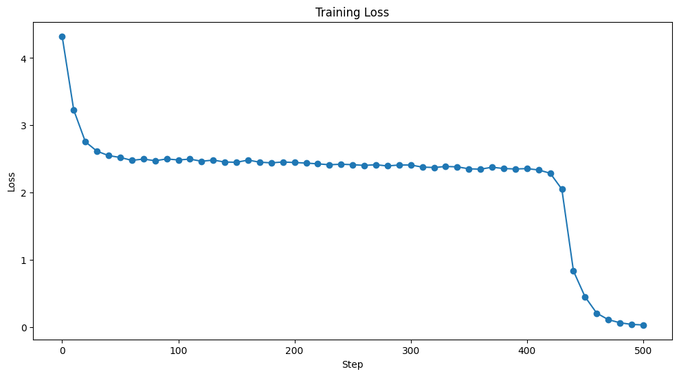

# nanoXLSTM


nanoXLSTM is a minimal codebase for playing around with language models based on the xLSTM (extended Long Short-Term Memory) architecture from the awesome research paper: xLSTM: Extended Long Short-Term Memory and heavily inspired by Andrej Karpathy's [nanoGPT](https://github.com/karpathy/nanoGPT).



\*\*Note: Work in progress!!!
I am working on improving the generated text.

No lofty goals here - just a simple codebase for tinkering with this innovative xLSTM technology!

Contributions are more than welcome as I continue exploring this exciting research direction.

## install

```
pip install torch numpy transformers datasets tiktoken wandb tqdm
```

## data prep

!python data/shakespeare_char/prepare.py

## train

```
python train.py config/train_shakespeare_char.py
```

## inference

```
python sample.py --out_dir=out-shakespeare-char
```

## todos

- Run hyperparameter sweep

## changelog

## Model changes:

- [x] Import OneCycleLR: The OneCycleLR scheduler is imported from `torch.optim.lr_scheduler`.
- [x] `sLSTM` class: The `f_bias` and `dropout` are added to the `sLSTM` class.
- [x] `mLSTM` class: The `f_bias` and `dropout` are added to the `mLSTM` class.
- [x] `xLSTMBlock` class: The `xLSTMBlock` class is implemented with a configurable ratio of `sLSTM` and `mLSTM` blocks, and layer normalization is applied.
- [x] `GPT` class: The `xLSTM_blocks` are used in the `GPT` class instead of separate `sLSTM` and `mLSTM` blocks.
- [x] `configure_optimizers` method: The `configure_optimizers` method in the `GPT` class is updated to use AdamW optimizer and OneCycleLR scheduler.

20/05/24

- [x] Initialize the forget gate bias (self.f_bias) with values between 3 and 6 instead of ones. This helps the forget gate to be effective from the beginning of training.
- [x] Introduce a stabilization technique to avoid overflow due to the exponential function. You can use the max function to compute a stabilization factor and subtract it from the input gate and forget gate activations before applying the exponential function.

## Training script changes:

- [x] Import statement: The OneCycleLR scheduler is imported.
- [x] Optimizer and scheduler initialization: The optimizer and scheduler are obtained from the `configure_optimizers` method of the `GPT` class.
- [x] Loading optimizer and scheduler state: The optimizer and scheduler states are loaded from the checkpoint when resuming training.
- [x] Saving scheduler state: The scheduler state is included in the checkpoint dictionary.
- [x] Stepping the scheduler: The `scheduler.step()` is called after each optimizer step.
- [x] Logging learning rate and MFU: The learning rate and MFU are logged using `wandb` (if `wandb_log` is enabled).
- [x] `estimate_loss` function: The `estimate_loss` function is updated to use the `ctx` context manager.
- [x] Training loop: The training loop is updated to use `scaler.scale(loss).backward()` and `scaler.step(optimizer)` for gradient scaling when training in fp16.
